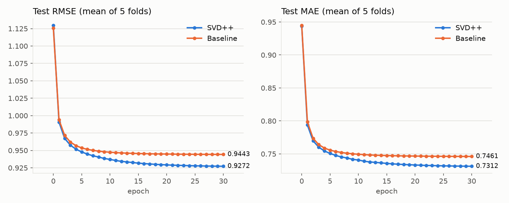

# SVD++


Part I

1. Rating prediction formula and its explanation 

Let  $R_{n \times m}$ be a rating matrix containing the ratings of $n$ users for $m$  items. Each matrix element  $r_{ui}$ refers to the rating of user $u$ for item  $i$. 

The predictive rating of the SVD++ model is

$$
r_{ui} = \mu + b_u + b_i + q_i^T \left(p_u + \frac{1}{\sqrt{|R(u)|}}\sum_{j\in R(u)} y_j \right)
$$

where $μ$ is the overall average rating and $b_u$ and $b_i$ indicate the observed deviations of user $u$ and item $i$, respectively. $R(u)$ is the set of items rated by user $u$, $y_j$ represents the implicit feedback vector of item j.

2. Objective function

$$
\begin{aligned}
\min_{b, p, q, y} \sum_{r_{u i} \in R} \Bigg[ & \left(r_{u i}-\mu-b_{u}-b_{i}-q_{i}^{T}\Big(p_{u}+|R(u)|^{-1 / 2} \sum_{j \in R(u)} y_{j}\Big)\right)^{2} \\
& +\lambda_1\left(b_{u}^{2}+b_{i}^{2}\right)+\lambda_2\Big(\lVert p_{u} \rVert^{2}+\lVert q_{i} \rVert^{2}+\sum_{j \in R(u)}\lVert y_{j} \rVert^{2}\Big)\Bigg]
\end{aligned}
$$

Besides error between estimate rating and actual rating, regularization was introduced in order to avoid overfitting. It is penalty on the parameter, make sure it will not become to large to affact the result dominantly. I think the reason why a regularization is necessary in this case is that the data is really sparse compared to the parameters in model. After several iterations, the model is very likely to 'memorize' all the ratings. Thus, the loss on the training set will not match the loss on the validation set.  In accordance to the paper, $\lambda_1$ is set to 0.005, $\lambda_2$ is set to 0.015 in my code.

3. Parameter update rules by SGD

   for each rating $r_{ui}$ in the (shuffled) training set, compute the error $e_{ui} = r_{ui} - \hat{r}_{ui}$ and update $b_u$, $b_i$, $q_i$, $p_u$ and $y_j$ according to the following rules (all right-hand sides use the values from before this step):

   - $b_{u} \leftarrow b_{u}+\gamma \cdot\left(e_{u i}-\lambda_{1} \cdot b_{u}\right)$

   - $b_{i} \leftarrow b_{i}+\gamma \cdot\left(e_{u i}-\lambda_{1} \cdot b_{i}\right)$

   - $q_{i} \leftarrow q_{i}+\gamma \cdot\left(e_{u i} \cdot\left(p_{u}+|\mathrm{R}(u)|^{-\frac{1}{2}} \sum_{j \in \mathrm{R}(u)} y_{j}\right)-\lambda_{2} \cdot q_{i}\right)$

   - $p_{u} \leftarrow p_{u}+\gamma \cdot\left(e_{u i} \cdot q_{i}-\lambda_{2} \cdot p_{u}\right)$

   - $\forall_{j} \in \mathrm{R}(u): y_{j} \leftarrow y_{j}+\gamma \cdot\left(e_{u i} \cdot|\mathrm{R}(u)|^{-\frac{1}{2}} \cdot q_{i}-\lambda_{2} \cdot y_{j}\right)$


4. Relations with other latent factor models 

The SVD++ model, which is a derivative model of SVD, is the research object, and three new algorithms that apply DP to SVD++ using gradient perturbation, objective-function perturbation, and output perturbation are proposed. To improve the predictive accuracy, SVD++ considers the related information of the user and item. The theoretical proofs are given and the experiment results show that the new private SVD++ algorithms obtain better predictive accuracy, compared with the same DP treatment of traditional MF and SVD. The DP parameter is the key to the privacy protection power, but in the current study, it was selected by experience. Finally, an effective trade-off scheme is given that can balance the privacy protection and the predictive accuracy to a certain extent and can provide a reasonable range for parameter selection. 

5. Pseudo-code Algorithm

   ```
   SVD++ Algorithm:
   Input:  m       # numbers of users
           n       # numbers of items
           k       # the length of p & q, hyper-parameter
           epochs  # total epochs
           lr      # learning rate
           decay   # decay of learning rate
           l1      # regularization parameter of b_u, b_i
           l2      # regularization parameter of p_u, q_i, y_j
           ts      # training set
   Params: b_u     # user bias
           b_i     # item bias
           p_u     # vector of user preference
           q_i     # vector of item quality
           y_j     # implicit feedback vector of item j
   initialize b_u, b_i with 0 and p_u, q_i, y_j with N(0, 0.1^2) random values
   mu = mean rating of ts
   for epoch in epochs:
       shuffle ts
       for (u, i, r_ui) in ts:
           z = |R(u)|^(-1/2) * sum(y_j for j in R(u))
           e_ui = r_ui - (mu + b_u + b_i + q_i . (p_u + z))
           update (right-hand sides use the values from before this step):
               b_u = b_u + lr * (e_ui - l1 * b_u)
               b_i = b_i + lr * (e_ui - l1 * b_i)
               q_i = q_i + lr * (e_ui * (p_u + z) - l2 * q_i)
               p_u = p_u + lr * (e_ui * q_i - l2 * p_u)
               for j in R(u):
                   y_j = y_j + lr * (e_ui * |R(u)|^(-1/2) * q_i - l2 * y_j)
       calculate test MAE and RMSE
       lr = lr * decay
   ```

Part II

1. Results including MAE/RMSE/Training Time/Test Time by 5-fold cross validation

   K (the length of $p_u$ and $q_i$) is 50; the other hyper-parameters follow the SVD++ paper: learning rate 0.007 decayed by 0.9 per epoch, $\lambda_1 = 0.005$, $\lambda_2 = 0.015$, 30 epochs. The baseline is the same model with K = 0, i.e. $\hat{r}_{ui} = \mu + b_u + b_i$. Numbers are the mean over the five splits `u1`-`u5` (seed 0), timed on an Intel Xeon w7-3555.

   | Model    | RMSE   | MAE    | total training time | training time per epoch | test time per evaluation |
   |----------|--------|--------|---------------------|-------------------------|--------------------------|
   | SVD++    | 0.9272 | 0.7312 | 1.62 s              | 0.011 s                 | 0.007 s                  |
   | Baseline | 0.9443 | 0.7461 | 0.09 s              | 0.0006 s                | 0.0003 s                 |

2. The curve of loss value relative to training iterations

   

3. How to run

   ```
   pip install -r requirements.txt
   python svdpp.py                                    # SVD++, 5 folds -> results/svdpp.json
   python svdpp.py --k 0 --out results/baseline.json  # baseline -> results/baseline.json
   python plot.py                                     # curve.png and the numbers above
   ```

   `python svdpp.py --help` lists all hyper-parameters.

4. Implementation note

   Applied literally, the update rules touch every $y_j, j \in R(u)$ for every rating, which costs $O(|R(u)| \cdot k)$ per rating. `svdpp.py` visits the ratings grouped by user (users in random order, each user's ratings in random order), keeps $\sum_{j \in R(u)} y_j$ up to date in $O(k)$, and applies the accumulated $y_j$ update once after the user's last rating. This is exactly the same SGD (checked against the literal version: parameters agree to 1e-14) at $O(k)$ per rating; compiled with numba, an epoch takes about 0.01 s.
